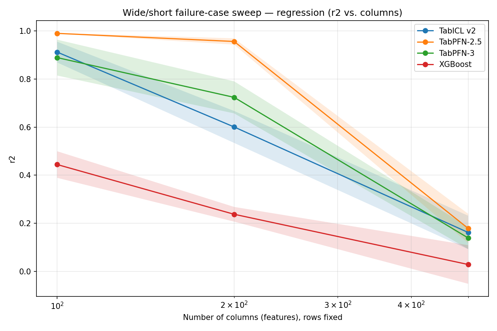
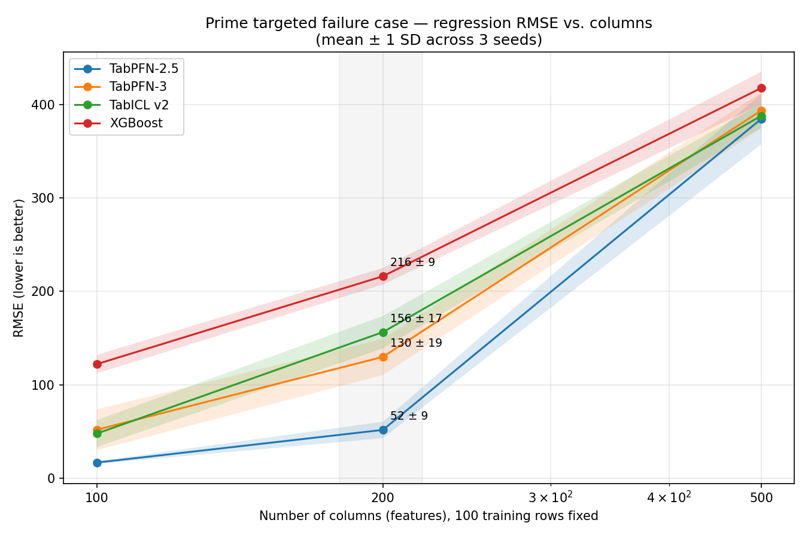

# TFM Failure Cases: wide, short regression

Where tabular foundation models (TFMs) fail on wide, short data (few rows, many columns), centered on one reproducible predictive failure case plus a real-world validation attempt.

## Research question

On synthetic wide, short regression data (100 training rows, increasing column count), does TabPFN-2.5 remain more robust than the newer TabPFN-3 and TabICL v2 — and does that hold up on a real biomedical dataset?

## Prime failure case: regression at 200 columns

Three independently generated datasets (seeds 0, 1, 2), 100 training rows, 500 test rows, columns swept at 100 / 200 / 500. Four models: TabPFN-2.5, TabPFN-3, TabICL v2, XGBoost.

**R² (mean across 3 seeds):**

| Columns | TabPFN-2.5 | TabPFN-3 | TabICL v2 | XGBoost |
|---:|---:|---:|---:|---:|
| 100 | 0.990 | 0.889 | 0.912 | 0.444 |
| **200** | **0.956** | **0.724** | **0.601** | **0.237** |
| 500 | 0.179 | 0.139 | 0.162 | 0.029 |

**RMSE (mean ± SD across 3 seeds):**

| Columns | TabPFN-2.5 | TabPFN-3 | TabICL v2 | XGBoost |
|---:|---:|---:|---:|---:|
| 100 | 16.5 ± 1.5 | 51.6 ± 21.8 | 47.5 ± 14.5 | 122.0 ± 9.9 |
| **200** | **51.6 ± 8.9** | **129.8 ± 19.4** | **156.4 ± 17.3** | **216.2 ± 9.0** |
| 500 | 384.9 ± 27.2 | 393.9 ± 19.4 | 388.2 ± 12.7 | 418.0 ± 17.4 |

At 200 columns, TabPFN-2.5 wins on every one of the three seeds by both metrics. By 500 columns, all four models converge toward general collapse — that's a task-level failure, not a model-specific one.





**Reproduce:**

```bash
python3 run_benchmark.py --tasks regression --models tabpfn_v2_5 tabpfn_v3 tabicl_v2 \
  --column-sweep 100 200 500 --seeds 0 1 2 --output results/targeted_regression_failure_case.csv
python3 run_benchmark.py --tasks regression --models xgboost \
  --column-sweep 100 200 500 --seeds 0 1 2 --output results/targeted_regression_failure_case.csv
python3 plot_results.py --input results/targeted_regression_failure_case_clean.csv \
  --outdir results/targeted_regression_final_plots
```

## Real-world validation: GSE40279 (human DNA-methylation age)

Tests whether the 200-column advantage transfers to a real biomedical regression task: predicting chronological age from blood DNA-methylation (CpG) measurements. 164 people, 200 CpGs selected by training-fold-only correlation with age, three independent 80/20 splits. Adds Ridge regression as a linear sanity-check baseline.

| Model | Mean R² (3 splits) | SD | Mean MAE | Splits won |
|---|---:|---:|---:|---:|
| TabPFN-3 | 0.822 | 0.063 | 4.12 yrs | 1 |
| TabICL v2 | 0.800 | 0.093 | 4.14 yrs | 1 |
| TabPFN-2.5 | 0.787 | 0.086 | 4.27 yrs | 1 |
| XGBoost | 0.741 | 0.107 | 5.00 yrs | 0 |
| Ridge | 0.736 | 0.036 | 4.88 yrs | 0 |

Each TFM won exactly one of the three splits — there is no stable real-world winner. This narrows the synthetic result rather than confirming it: TabPFN-2.5's advantage at 200 columns is a reproducible synthetic-regime finding, not evidence that it's universally superior on wide, short data. The gap between what the synthetic generator rewards and what a real dataset rewards is itself part of the story.

**Reproduce:**

```bash
python3 prepare_gse40279.py
python3 run_real_world_methylation.py --folds 1 --repeats 3 --selection correlation \
  --feature-counts 200 --models tabpfn_v2_5 tabpfn_v3 tabicl_v2 --output results/gse40279_pilot.csv
python3 run_real_world_methylation.py --folds 1 --repeats 3 --selection correlation \
  --feature-counts 200 --models xgboost ridge --output results/gse40279_pilot.csv
python3 plot_real_world_methylation.py
```

## Repo structure

- `data_generation.py`, `models.py`, `run_benchmark.py`, `plot_results.py` — synthetic generator, model wrappers, and the sweep/plotting code behind the prime failure case.
- `prepare_gse40279.py`, `run_real_world_methylation.py`, `plot_real_world_methylation.py` — the real-world validation pipeline.
- `results/` — CSVs and plots for both studies above.
- `supporting_experiments/` — everything that informed the approach but isn't the headline result: the original 50–5,000 column single-seed sweep that first surfaced the 200-column pattern, and the arithmetic-chain study (noise/OOD/hierarchical-depth experiments). Useful for the methodology section, not the poster's main claim.

`data/gse40279/` (the prepared 164×473,034 methylation matrix) is gitignored — regenerate it locally with `python3 prepare_gse40279.py`.

## Limitations

- The prime failure case uses 3 seeds; the real-world validation uses 3 splits of one 164-person dataset. Neither is a large sample.
- No architectural ablation establishes *why* TabPFN-2.5 does better at 200 columns — feature subsampling, ensembling, and pretraining-distribution mismatch are plausible but unconfirmed mechanisms.
- Real-world feature selection (training-fold-only correlation ranking) is one reasonable choice among several; a different selection method could shift results.
