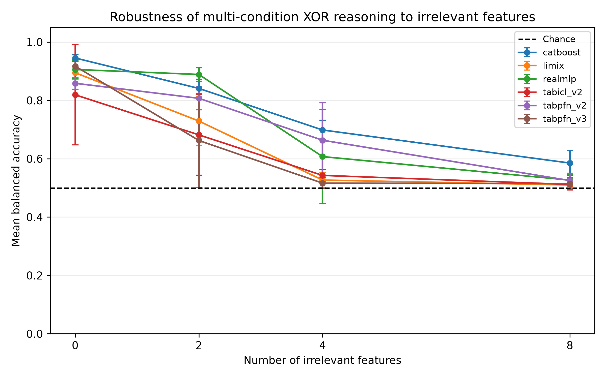

# Multi-condition XOR under irrelevant-feature dilution

This branch contains a controlled classification benchmark for testing whether tabular models recover a four-condition XOR rule as irrelevant Gaussian features are added.

## Research question

How robust are tabular foundation models and classical tabular baselines when a balanced interaction-based target is surrounded by features that contain no label information?

## Dataset

Each dataset contains 1,000 independently generated rows:

- 750 training rows;
- 250 test rows;
- four relevant continuous features sampled from a standard normal distribution;
- zero, two, four, or eight additional standard-normal noise features;
- five dataset seeds: 0, 1, 2, 3, and 4.

The label is the XOR reduction of four threshold conditions:

```text
y = (x1 > 0) XOR (x2 > 0) XOR (x3 > 0) XOR (x4 > 0)
```

The threshold indicators are used only to construct and validate the target. Models receive the original continuous features, not the engineered Boolean variables.

## Evaluated models

- CatBoost
- RealMLP-TD
- LimiX-16M
- TabPFN-v2
- TabPFN-v3
- TabICL v2

Balanced accuracy is the primary metric because it remains interpretable if a finite generated sample is not perfectly balanced.

## Main result

Mean balanced accuracy across five seeds:

| Model | 0 noise features | 4 noise features | 8 noise features |
|---|---:|---:|---:|
| CatBoost | 0.945 | 0.699 | 0.585 |
| TabPFN-v2 | 0.859 | 0.663 | 0.525 |
| RealMLP-TD | 0.906 | 0.607 | 0.527 |
| TabICL v2 | 0.819 | 0.543 | 0.512 |
| LimiX-16M | 0.895 | 0.527 | 0.510 |
| TabPFN-v3 | 0.917 | 0.516 | 0.515 |

At four irrelevant features, several foundation models are close to chance while CatBoost remains substantially stronger. This makes the condition a comparative failure case rather than evidence that the target has become universally unlearnable.



## Reproduce the sweep

Create the environment:

```bash
conda env create -f environment.yml
conda activate tfm-failure
```

RealMLP requires `pytabkit`. LimiX is not installed from PyPI; follow the LimiX repository instructions and set `LIMIX_REPO_PATH` to the local checkout.

Run the exact five-seed benchmark:

```bash
python logical_l3_noise_sweep.py \
  --models catboost realmlp tabicl_v2 limix tabpfn_v2 tabpfn_v3 \
  --seeds 0 1 2 3 4
```

The runner writes each completed cell immediately, skips completed cells on restart, validates the dataset rule and split, creates the summary CSV, and regenerates the plot.

## Output files

- `results/logical_l3_noise_sweep/logical_l3_noise_sweep_raw.csv`: one row per model, seed, and noise level.
- `results/logical_l3_noise_sweep/logical_l3_noise_sweep_summary.csv`: means and standard deviations.
- `results/logical_l3_noise_sweep/logical_l3_noise_sweep_validation.csv`: dataset and run-integrity checks.
- `results/logical_l3_noise_sweep/plots/`: generated figures.
- `poster/`: poster-ready figures and the selected findings table.

## Supporting controls

`logical_evaluation.py` contains AND, OR, and XOR controls with zero or four irrelevant features. These controls distinguish general classification failure from sensitivity to the higher-order XOR interaction.

## Limitations

- The benchmark is synthetic and tests one family of logical rules.
- Five seeds quantify generator variability but do not cover alternative noise distributions.
- The result identifies model-specific behavior but does not establish its architectural cause.
- Model checkpoints and package versions may change after the recorded runs.
