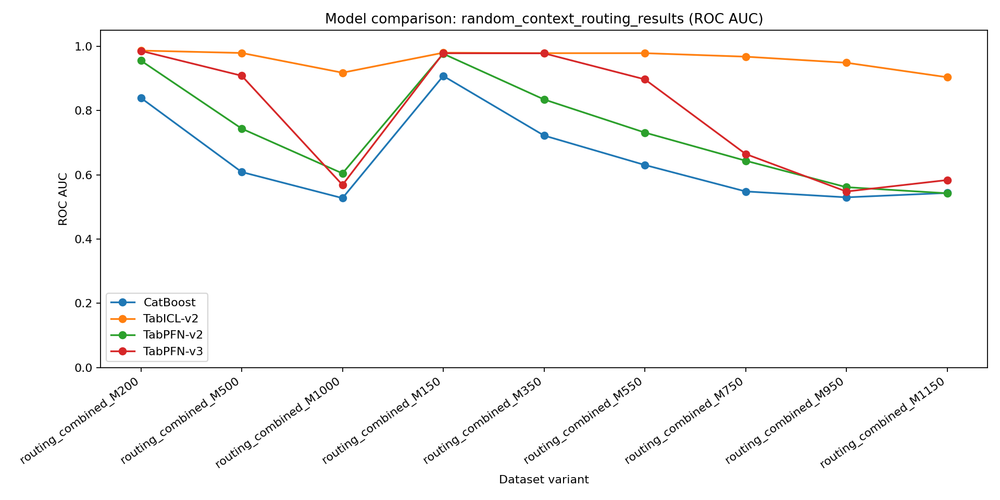
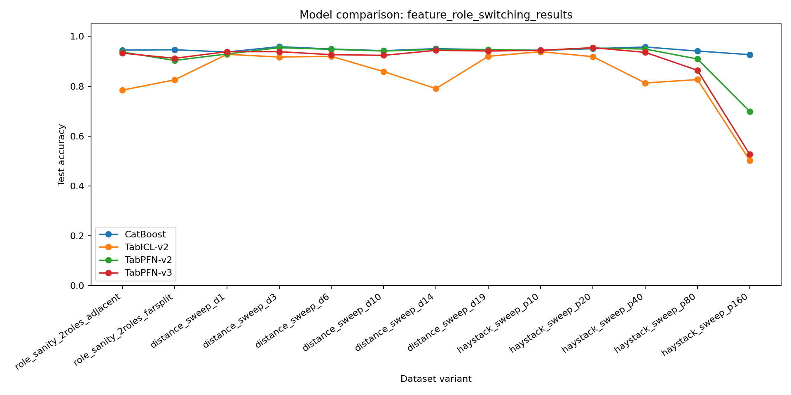

# Few-shot context routing and feature-grouping benchmarks

This branch contains two synthetic classification studies:

1. random context routing, which varies the number of examples available for each categorical key;
2. feature grouping, which varies irrelevant-feature count and the position of an interacting feature pair.

## Random context routing

### Task

Each categorical key is assigned a random binary label. A sample contains:

- one encoded key;
- ten independent Gaussian decoy features;
- a label obtained from the key-specific lookup table;
- a 2% probability of label flipping.

The training set contains 3,000 rows and the test set contains 400 rows. Increasing the number of possible keys decreases the expected examples per key:

```text
shots per key = 3,000 / number of keys
```

The key is represented as a well-separated floating-point value with small jitter. The same dataset and split are supplied to every model within a seed.

### Finding

TabICL v2 remains substantially stronger as the number of examples per key becomes small. At 1,150 keys, corresponding to approximately 2.6 training examples per key, the recorded mean results are:

| Model | Accuracy | ROC-AUC | Macro-F1 |
|---|---:|---:|---:|
| TabICL v2 | 0.830 | 0.904 | 0.829 |
| TabPFN-v3 | 0.563 | 0.584 | 0.459 |
| CatBoost | 0.542 | 0.544 | 0.535 |
| TabPFN-v2 | 0.534 | 0.542 | 0.407 |

The result indicates a model-specific robustness difference in sparse categorical lookup. It does not imply that TabICL v2 is strongest on unrelated tabular tasks.



## Feature grouping and irrelevant-feature dilution

The second study uses a binary interaction target:

```text
y = 1[(xa * xb + noise) > 0]
```

It contains three groups of variants:

- role-sanity controls with two possible interacting pairs;
- a distance sweep in a fixed 20-feature pool;
- a haystack sweep in which the active pair remains at maximum separation while the pool grows from 10 to 160 features.

CatBoost remains above 0.92 accuracy across the recorded haystack sweep. At 160 features, TabPFN-v3 and TabICL v2 approach chance while TabPFN-v2 remains above chance but degrades. This is evidence for sensitivity to irrelevant-feature dilution; the distance-only sweep does not show a stable monotonic distance effect.



## Installation

```bash
conda env create -f environment.yml
conda activate tfm-failure
```

LimiX requires a separate local installation and the `LIMIX_REPO_PATH` environment variable. It is not used in the two headline runs documented here.

## Reproducing the experiments

Random context routing:

```bash
python -m failure_cases.random_context_routing
python visualize_results.py --results results/random_context_routing_results.csv
```

Feature grouping:

```bash
python -m failure_cases.feature_role_switching
python visualize_results.py --results results/feature_role_switching_results.csv
```

Both runners write raw results to `results/`. The visualization script creates per-variant summaries and accuracy, ROC-AUC, and macro-F1 plots.

## Result provenance

The committed random-context summary includes anchor variants and a denser bridge sweep produced during successive controlled runs of the same generator family. See `results/PROVENANCE.md` for the exact distinction. The saved values are retained as recorded rather than recomputed during repository preparation.

## Repository structure

- `failure_cases/random_context_routing.py`: categorical lookup generator and runner.
- `failure_cases/feature_role_switching.py`: interaction-distance and haystack generators.
- `models.py`: lazy model registry.
- `metrics.py`: shared classification metrics and timing.
- `visualize_results.py`: summary tables and figures.
- `results/`: committed raw results, summaries, and plots.

## Limitations

- The routing experiment uses two seeds in its current runner.
- The context-routing summary combines documented anchor and bridge runs.
- Feature distance and irrelevant-feature count must be interpreted separately.
- The studies identify behavioral differences, not their architectural causes.
- Exact results may change with future model checkpoints or package versions.
